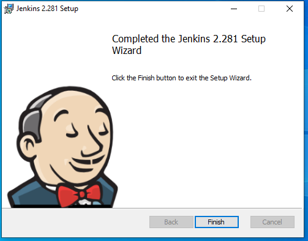
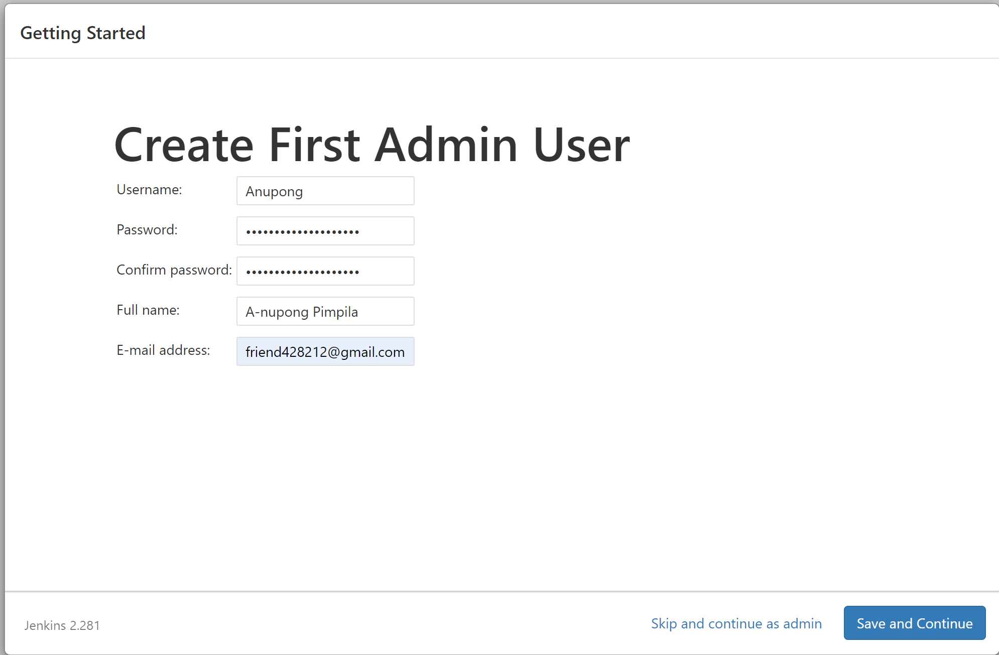

# Assignment#1 การติดตั้ง Jenkins ใช้งานร่วมกับ GIT ,Python และ Robot Framework

 

## ขั้นตอนการติดตั้ง Jenkins

 

 

- ค้นหาว่า Jenkins

 

 

 

- กดDownload

 

 

 

- กด Windows

 

 

 

- รอการดาวน์โหลด

 

 

 

- กด Next

 

 

- กด Next

 

 

- เลือก Run as service as LocalSystem
- กด Next

 

 

- เลือก port
- กด Next

 

 

- กด Next

 

 

- กด Next

 

 

- กด Install

 

 

- รอ

 

 

- กด Finish

 

 

- เมื่อมีหน้าเว็บขึ้นมา ให้ทำการค้นหาไฟล์ Password ตามที่อยู่ตัวสีแดง
- แล้วทำการกรอก Password ลงไป

 

 

- กด Install suggested plugins

 

 

- แล้วรอการติดตั้งสักครู่

 

 

- สำหรับการเข้าครั้งแรก ให้กรอกแบบฟอร์มตามที่กำหนดให้ถูกต้อง

 

 

- เมื่อเสร็จแล้ว จะมีหน้าแสดง URL + port ขึ้นมา ให้ทำการบันทึกไว้
- กด Save and Finish

 

 

- กด Start using Jenkins

 

## การสร้างโปรเจคใน Jenkinds
 

 

- เมื่อเข้ามาแล้ว ให้กดที่ Create a Job เพื่อสร้างไฟล์โปรเจคใหม่ขึ้นมา

 

## การสร้างโปรเจคใน Jenkinds ร่วมกับการใช้ GIT 

 

 

- ให้ตั้งชื่อโปรเจค โดยในที่นี้จะตั้งชื่อว่า Assignment1_jenkinds_GIT
- แล้วเลือก Freestyle Project
- แล้วกด Next

 

 

 

- จะได้หน้าเพจแบบนี้ขึ้นมา
- ทำการ Configure เพื่อตั้งค่าโปรเจคของเรา

 

 

- เลือกไปที่ Repository URL ที่อยู่ใต้แท็บ Source Code Management
- ให้ใส่ที่อยู่ Repository ของเราที่สร้างไว้ ซึ่งมีที่อยู่ว่า https://github.com/friend-anupong/Assignment-1

- แล้วตรง Branch ให้ใส่ตามที่ตั้งไว้ ซึ่งมีชื่อว่า */main
- แล้วกด Save

 

 

- Save แล้ว ให้กด Build Now 
- แล้วคลิกเข้าไปที่ตัวเลขที่แสดงไว้ข้างวางกลมสีน้ำเงิน

 

- แล้วกดเข้าไปที่ Console Output เพื่อดูผลการรัน

 

## การสร้างโปรเจคใน Jenkinds ร่วมกับการใช้ภาษา Python

 

- ให้ตั้งชื่อโปรเจค โดยในที่นี้จะตั้งชื่อว่า Assignment1_jenkinds_Python
- แล้วเลือก Freestyle Project
- แล้วกด Next

 

 

- แล้วกดออกมาที่หน้า Dashboard
- เข้าไปที่ Manage Jenkins 

 

 

- เข้าไปที่ Manage Plugins เพื่อตั้งค่าหรือติดตั้ง Plugins ต่างๆเพิ่มเติม

 

 

- ค้นหาคำว่า Python แล้วทำการติดตั้งทั้งหมด
- และ Restart Jenkins

 

 

- เมื่อทำการติดตั้งเสร็จแล้ว ให้ทำการกดไปที่ config เพื่อตั้งค่าต่างๆ

 

 

- ไปที่แท็บ Build แล้วเลือกตรงแถบข้างล่างว่า Execute Python Script
- ใส่ Code ภาษา python ลงไปเพื่อทำการทดสอบ

 

 

- ทำการกด Build Now และคลิกเข้าไปที่ตัวเลขที่แสดงไว้ข้างวางกลมสีน้ำเงิน

 

- ทำการกด Console Output เพื่อดูผลลัพธ์

 

## การสร้างโปรเจคใน Jenkinds ร่วมกับการใช้ Robot Framework

 

 

- ให้ตั้งชื่อโปรเจค โดยในที่นี้จะตั้งชื่อว่า Assignment1_Robotframework
- แล้วเลือก Freestyle Project
- แล้วกด Next

 

 

- เข้าไปที่ configure
- เลือกแท็บ Build
- แล้วไปที่ Build กดตรงที่ Execute Windows batch command
- Set path ที่ติดตั้ง Robot Framework และ Seleniun Library ไว้ เพื่อให้รันโปรแกรมได้
- เขียนคำสั่งเรียกใช้ไฟล์ .Robot โดยเรียกไฟล์ที่สร้างไว้ตาม path ที่เก็บข้อมูลไว้

 

 

- ตัวอย่าง code ในไฟล์ robot

 

 

- ตั้งค่า path นำเอาข้อมูลผลการรันมาสร้างกราฟ
- ตั้งค่า % ในการพล็อตกราฟ
- แล้วกด Save

 

 

- แล้วกด Build Now

 

 

- จะได้ผลการรันของ Robotframework ดังภาพข้างต้น
- คลิกเข้าไปที่ตัวเลขที่แสดงไว้ข้างวางกลมสีน้ำเงิน 

 

 

- จะได้ผลลัพธ์ ดังนี้

 

 

- กดไปที่ Console Output เพื่อแสดงผลลัพธ์ที่ได้

 

 

- ผลลัพธ์จากการทดสอบอื่นๆ ของ Robot Framework

 

 

- ผลลัพธ์รวมทั้งหมดจากหน้า Dashboard

 

